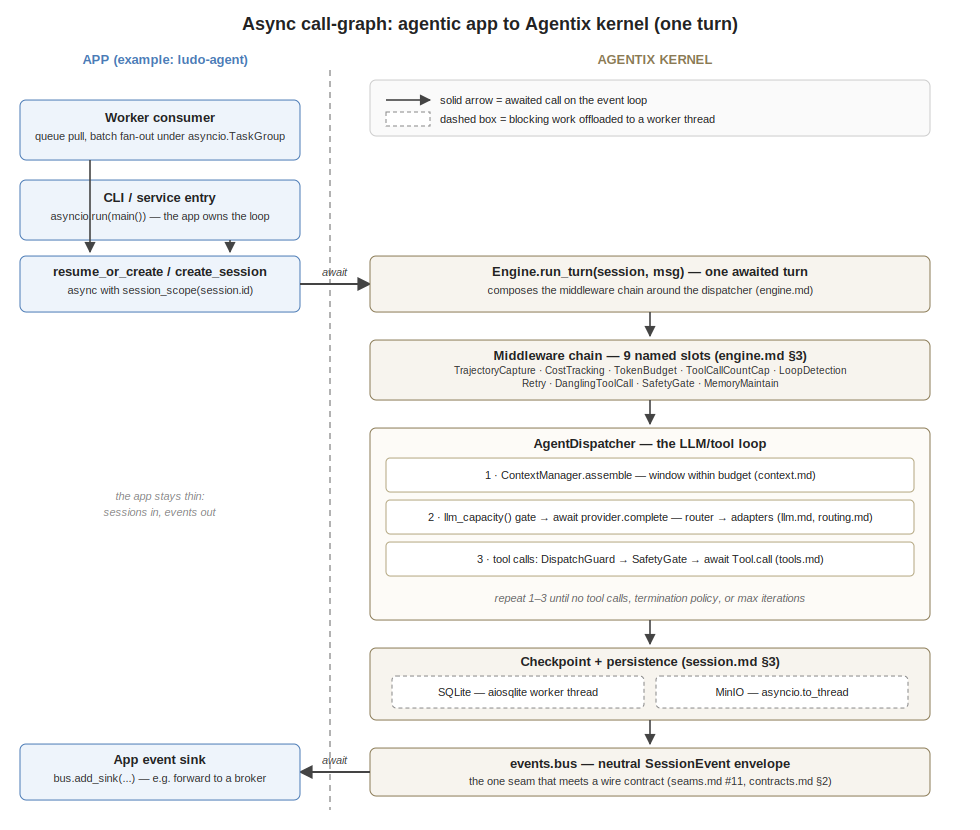

# Async — the execution model

**Status:** living doc · **Scope:** Agentix kernel `[K]` (app-agnostic)

**Single source of truth for the async execution model in `docs/`.** Sections 1–6
are **landed**; §7 is **DIRECTION**. Division of labour with the neighbour SSoTs
(CRIE rule — reference, never restate): [`isolation.md`](isolation.md) owns the
*correctness* invariants (I1–I7 — what makes concurrent sessions safe); this doc
owns the *execution model* — how the kernel runs on the event loop and which
facilities an app uses to exploit that. The OT / synchronous-integration plan is
[`sync.md`](sync.md).

---

## 1. The async substrate

The kernel is **async-only, and the caller owns the event loop**. Every kernel
surface is `async def` — `Engine.run_turn` (the sole turn entry point), every
store method, every provider `complete()`, every `Tool.call()`, every middleware.
There is no `asyncio.run` anywhere in `src/agentix/`: the app decides where the
loop lives (a worker process, a FastAPI server, a CLI `asyncio.run`), the kernel
never spawns or assumes one. The `runtime.py` builders (`build_llm_provider`,
`build_embedding_provider`) are plain sync functions that *return* async objects
— construct the graph anywhere, drive it on a loop.

The minimal app:

```python
import asyncio
from agentix.core.engine import Engine
from agentix.core.session import create_session

async def main() -> None:
    session = await create_session(sqlite, customer_id="c-1")
    turn = await engine.run_turn(session, user_message=msg)

asyncio.run(main())          # the app owns the loop; the kernel never calls this
```

Fan-out over sessions is structured concurrency on the app side, one task per
session with its own cost scope:

```python
from agentix.llm.cost_recorder import session_scope

async def run_one(session):
    async with session_scope(session.id):     # per-task cost binding (I1)
        await engine.run_turn(session)

async with asyncio.TaskGroup() as tg:
    for s in sessions:
        tg.create_task(run_one(s))
```

(True multi-session fan-out inside one process still waits on the per-task
SQLite connection, §7 — today's reference app runs single-flight.)

## 2. The call-graph — app → kernel



The walk, left to right: the app's entry surface (a queue consumer fanning a
batch out under a `TaskGroup`, or a CLI wrapping `asyncio.run`) obtains a
session (`resume_or_create` on redelivery, `create_session` otherwise), binds the
cost scope, and awaits `Engine.run_turn`. Inside the kernel the middleware chain
([`engine.md`](engine.md) §3) wraps the dispatcher loop: assemble the window →
acquire LLM capacity → `await provider.complete` → dispatch tool calls through
the guard and the safety gate → repeat until done → checkpoint → events out to
the app's sink. Solid arrows are awaited calls on the loop; dashed boxes are
blocking work pushed off the loop (§3).

## 3. Blocking-offload discipline

One rule: **no blocking call ever runs on the event loop.** Four mechanisms
enforce it:

- **SQLite** — `aiosqlite` (`storage/sqlite_store.py`); the driver serializes
  blocking `sqlite3` calls onto its worker thread.
- **`asyncio.to_thread`** — the MinIO SDK (blocking HTTP) in
  `storage/minio_store.py`, and file I/O in `storage/memory.py` (page
  reads/writes, directory scans).
- **Polled non-blocking `flock`** — `MemoryStore.lock` never blocks on the OS
  lock: it tries `LOCK_NB` in a retry loop with `await asyncio.sleep` backoff
  ([`memory.md`](memory.md) §3).
- **Async subprocesses** — spike tools use `asyncio.create_subprocess_exec` +
  `wait_for` timeouts, never `subprocess.run` ([`tools.md`](tools.md) §4).

A new kernel component that touches disk, network or a subprocess must pick one
of these four — that's the review checklist.

## 4. Loop- and task-scoped state

Two pieces of kernel state are deliberately scoped to async machinery — which is
also why naive sync calling is a hard error, not a style question:

- **Per-loop capacity semaphore** (`drivers/limiter.py`) — the global model-call gate is an
  `asyncio.Semaphore` keyed by `id(get_running_loop())`, so tests crossing
  `asyncio.run` boundaries get fresh gates and a stale-loop semaphore is never
  reused ([`isolation.md`](isolation.md) I5). No running loop → no semaphore.
- **Per-task cost binding** (`drivers/session.py`) — the current session id is
  a `ContextVar`, copied into every child task, so concurrent sessions in one
  loop record costs to the right session ([`isolation.md`](isolation.md) I1).
  Sync code has no task context to bind.

Sync call-sites therefore go through a facade that owns a loop (§7, #70), never
by calling kernel coroutines "directly somehow".

## 5. How each primitive rides the async substrate

Every kernel framework is built *on* this model — the 1–2 sentence version of
each, with its SSoT:

- [`engine.md`](engine.md) — a turn is **one awaited call**: `run_turn` composes
  the middleware chain into a single `async` callable and awaits it; layers like
  Retry (`asyncio.sleep` backoff) only work because the whole chain suspends
  cheaply.
- [`session.md`](session.md) — persistence is async end-to-end: `save()` awaits
  MinIO-then-SQLite in order, and the lease heartbeat (`renew_session_lease`) is
  an awaited write inside the run loop, cheap enough to do every turn.
- [`context.md`](context.md) — window assembly and compression run *inside* the
  dispatch await; `compress_if_needed` piggybacks on the token counts the
  provider call just returned, adding no extra loop latency of its own.
- [`tools.md`](tools.md) — `Tool.call()` is an async protocol; the dispatcher
  bounds every call with `asyncio.wait_for`, and sandbox tools run subprocesses
  without blocking the loop (§3).
- [`skills.md`](skills.md) — progressive disclosure is an async-friendly shape:
  session start surfaces name+description cheaply; skill bodies load on demand
  as file I/O off the loop.
- [`memory.md`](memory.md) — the page store is `to_thread` file I/O behind the
  polled-`flock` async lock; concurrent maintain loops queue on the lock instead
  of corrupting a page.
- [`budgets.md`](budgets.md) — cost recording sits at the awaited call boundary
  (`CostRecordingProvider.complete`), reading the per-task `ContextVar` binding
  (§4), so every await records against the session that made it.
- [`drivers.md`](drivers.md) — `ChatDriver.complete` is the one async method everything
  speaks; adapters await the provider SDKs directly, and the capacity semaphore
  (§4) bounds how many are in flight per process.
- [`routing.md`](routing.md) — failover is a sequential `await` chain: try one
  provider, classify the error, await the next; the async `FailoverCallback`
  notifies operators without blocking dispatch.
- [`isolation.md`](isolation.md) — the invariants I1–I7 are exactly the rules
  that make *concurrent awaits* safe: task-scoped context, single-writer
  SQLite, lock-guarded memory, per-loop gates, leases for crashed workers.
- [`eval.md`](eval.md) — the adversarial refute pass is one more awaited
  provider call on the same substrate; it composes with capacity limiting and
  cost recording for free.
- [`a2a.md`](a2a.md) — delegation is inherently async: a delegate crossing is a
  request that completes later, which is a natural `await` (or a job on a
  broker), never a blocking wait.
- [`seams.md`](seams.md) / [`contracts.md`](contracts.md) — the events-out seam
  (#11) is an awaited sink: the kernel `await`s the app's forwarder with the
  neutral envelope; the app's transport (a wire contract) stays outside.
- [`sync.md`](sync.md) — the deliberate exception: how synchronous call-sites
  (OT integrators) get onto this substrate through a facade, without a sync
  kernel fork.

## 6. Facilities apps use today

The landed toolkit for exploiting the async kernel — each with its canonical doc:

- **Cost scope** — `session_scope(session_id)` / `bind_session()` +
  `unbind_session(token)` ([`budgets.md`](budgets.md) §3):

  ```python
  async with session_scope(session.id):
      await engine.run_turn(session)
  ```

- **Capacity gate** — `configure_llm_capacity(limit)` at startup (default 8);
  the dispatcher already wraps every provider call in `llm_capacity()`
  ([`isolation.md`](isolation.md) I5).

- **Lease (crash-safety heartbeat)** — `claim_session_lease(id, leased_by=…,
  ttl_seconds=…)` at run start, `renew_session_lease` each turn,
  `reap_expired_sessions()` in a janitor ([`session.md`](session.md) §6):

  ```python
  await sqlite.claim_session_lease(s.id, leased_by=worker_id, ttl_seconds=600)
  ```

- **Redelivery** — `resume_or_create(...)`: same job id resumes the running/
  paused session instead of restarting it ([`session.md`](session.md) §4).

- **Events out** — `bus.add_sink(async_sink)`: every kernel event is awaited
  into the app's forwarder ([`seams.md`](seams.md) #11).

- **Memory lock** — `async with memory.lock(name, timeout_seconds=10):` —
  advisory cross-process lock for memory writes ([`memory.md`](memory.md) §3).

---

*Everything below is DIRECTION — designed, tracked, not landed.*

## 7. Direction — facilities to build or lift

- **SessionRuntime** (#67, reserved as #21) — lift the app's session-run loop
  (lease claim/renew, batch fan-out under a `TaskGroup`, resume driving,
  graceful drain) into a kernel runtime, so apps stop hand-rolling it
  ([`isolation.md`](isolation.md) §I6/I7).
- **Per-task SQLite connection** (#39, invariant I2's open half) — the
  prerequisite for real multi-session fan-out in one process; until then,
  single-flight per process.
- **Turn deadline** (#71) — `run_turn(..., deadline_seconds=…)` via
  `asyncio.timeout`; expiry aborts cleanly → session `paused`, same operator
  semantics as a budget abort ([`budgets.md`](budgets.md) §4). The
  bounded-latency guarantee for time-sensitive workloads ([`sync.md`](sync.md)).
- **Cooperative-cancellation seam** (#72) — a kernel-native cancel hook checked
  between tool iterations (never mid-tool); generalizes the reference app's
  cancel registry. Becomes a numbered seam in [`seams.md`](seams.md) when it
  lands.
- **Sync facade** (#70, coming soon — documented, not yet scheduled) —
  `agentix.sync`: one dedicated background loop thread, blocking wrappers via
  `run_coroutine_threadsafe`. The supported path for sync call-sites; design in
  [`sync.md`](sync.md).
